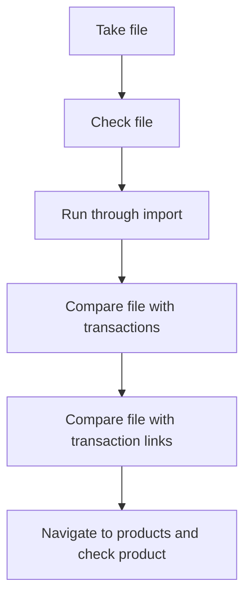

### TCO importing:

This page serves as a guide for testing the importer functionality related to TCO importing. The testing process is dated [[#Date]] and revolves around evaluating the effectiveness and accuracy of the cost importing feature. The page is organized into several sections for easy navigation.

### Date:

28/07/2023

### Tags:

[[importer]] 

### Sum
This testing will cover the importer test for costs.

### Table of Contents:

- [[#Notes]]
- [[#Related Notes]]
- [[#References]]
- [[#Backlinks]]
- [[#Attachments]]

### Notes

When importing the costs for cost import you'll need to first start with the file. I've attached the test files bellow [[#Attachments]].  

	We need:
	- Reg
	- Vin
	- Company code
	- Group code
	- Supplier name

- After the import you'll need to run the job on [[aws-Terminal-Tutorial]]

#### Areas to cover:



```text
compare file with item

compare file with mappings

compare file with report
```

### Related Notes:

none.

### References:

[[staging]](https://staging.ultraportal.co.uk/secure/dashboard)

### Backlinks:

none

### Attachments:

![[fuelImport.csv]]