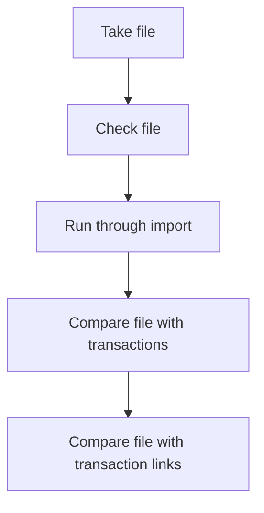

### Inventory importing:

This page serves as a guide for testing the importer functionality related to inventory importing. The testing process is dated [[#Date]] and revolves around evaluating the effectiveness and accuracy of the cost importing feature. The page is organized into several sections for easy navigation.

### Date:

28/07/2023

### Tags:

[[importer]] 

### Summary:

This testing will cover the importer test for costs.

### Table of Contents:

- [[#Notes]]
- [[#Related Notes]]
- [[#References]]
- [[#Backlinks]]
- [[#Attachments]]

### Notes

When importing the costs for cost import you'll need to first start with the file. I've attached the test files bellow [[#Attachments]].  

We need:
- vrn
- Vin
- Company = code
- Group = id
- Supplier = code or name
- company = select company
- group = id
- fuel group = lineage
	- e.g /tco/combustion/diesel/
- vehicle = licence plate 
- currency code = code

## Mapping image

After the import you'll need to run the job on [[aws-Terminal-Tutorial]]

#### Areas to cover:

### Related Notes:

none.

### References:

[[staging]] (https://staging.ultraportal.co.uk/secure/dashboard)

### Backlinks:

none

### Attachments:

![[invImport.csv]]