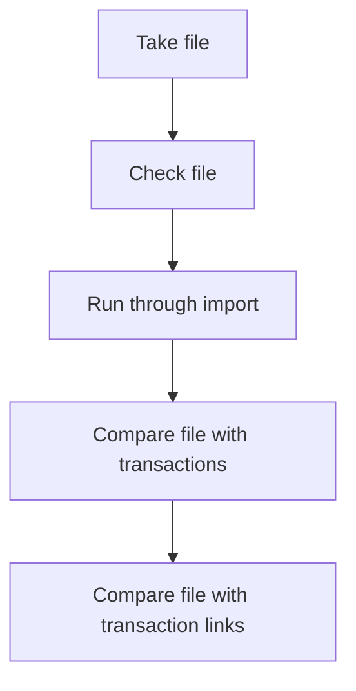

### Fleet costs importing:

This page serves as a guide for testing the importer functionality related to cost importing. The testing process is dated [[#Date]] and revolves around evaluating the effectiveness and accuracy of the cost importing feature. The page is organized into several sections for easy navigation.

### Date:

28/07/2023

### Tags:

[[importer]] 

### Summary:

This testing will cover the importer test for costs.

### Table of Contents:

- [[#Notes]]
- [[#Related Notes]]
- [[#References]]
- [[#Backlinks]]
- [[#Attachments]]

### Notes

When importing the costs for cost import you'll need to first start with the file. I've attached the test files bellow [[#Attachments]].  

	We need:
	- Reg
	- Vin
	- Company code
	- Group code
	- Supplier code

- If the supplier isn't found it'll create a new one.
- Multilease suppliers
- Cost group code
- Group has to be part of the company
- Only need to specify the company. The rest will be read from the spreadsheet.

Transaction fields to import

 
Mapping name 
/ Unique key 
/ Gross 
/ Net 
/ Vat 
/ Vat rate 
/ Total 
/ Client number
/Client country
/Invoice number
/Vrn
/Vin
/Invoice date
/Invoice line code
/Invoice line description
/Group code
/ Cost group code
/ Provider Company 
/ mapping
/ company = select on the next page
/ cost Group = cost group code
/ group = group code
/ vehicle = vrn
/ supplier = provider
/ currency = select on next page

- transaction reference
- Select company.
- Match field with fields in database
- Find something with code or "name" - code 
- vehicle always maps to licence plate number
- supplier = name

#### Areas to cover:

### Related Notes:

none.

### References:

[staging ultraportal](https://staging.ultraportal.co.uk/secure/dashboard)

### Backlinks:

none

### Attachments:

File provided by john:

![[Key accounts - LKQ - Maintenance & OOS Costs kopie 1 copy.xlsx]]

Test file:
![[test-cost-import.csv]]